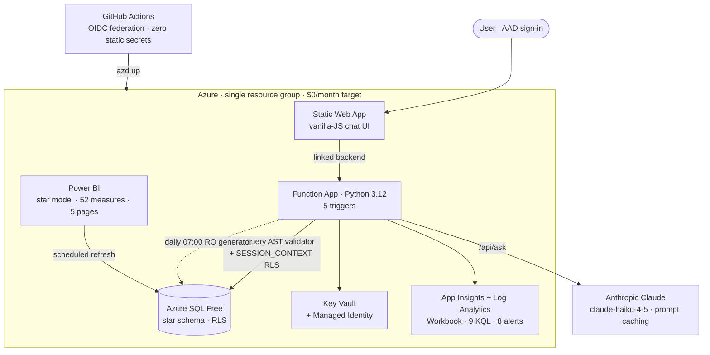
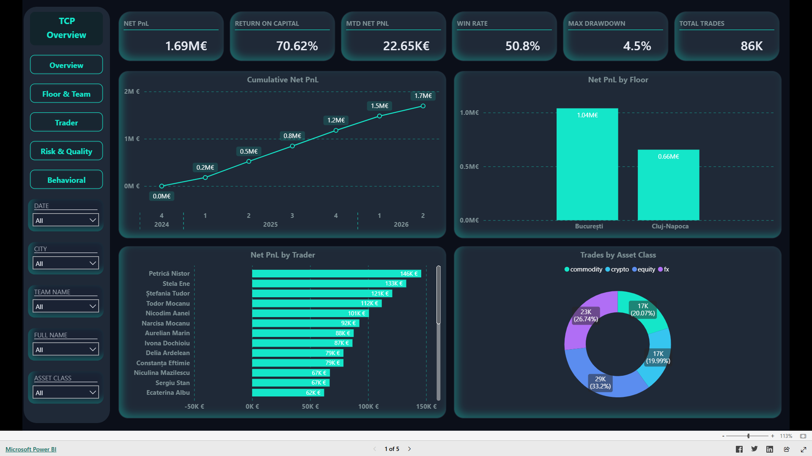
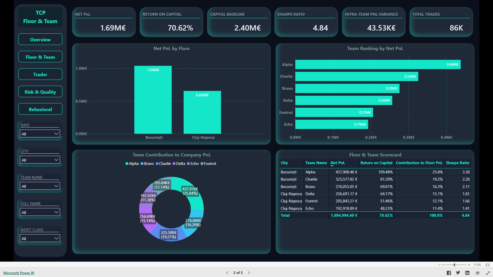
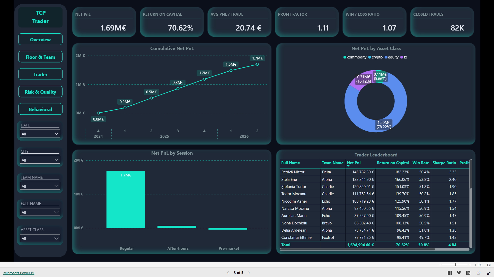
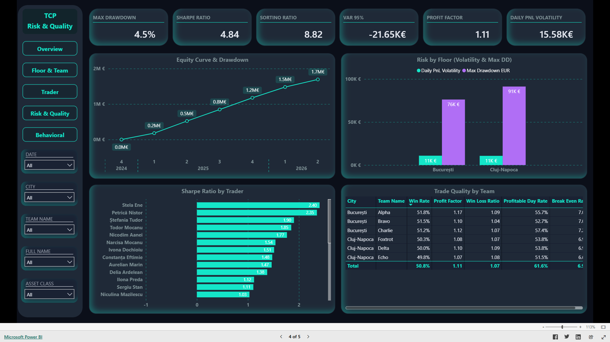
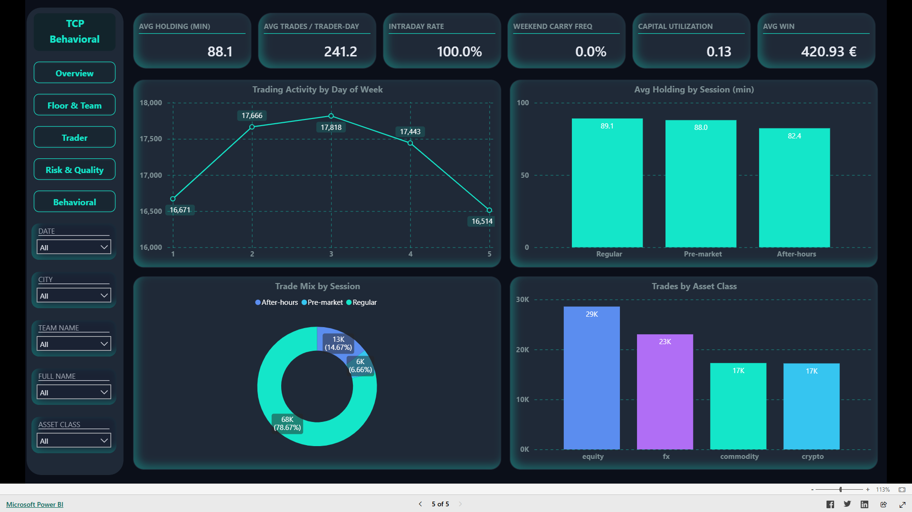
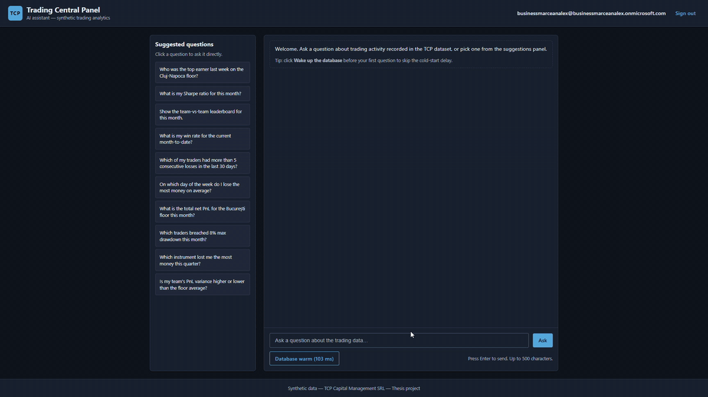
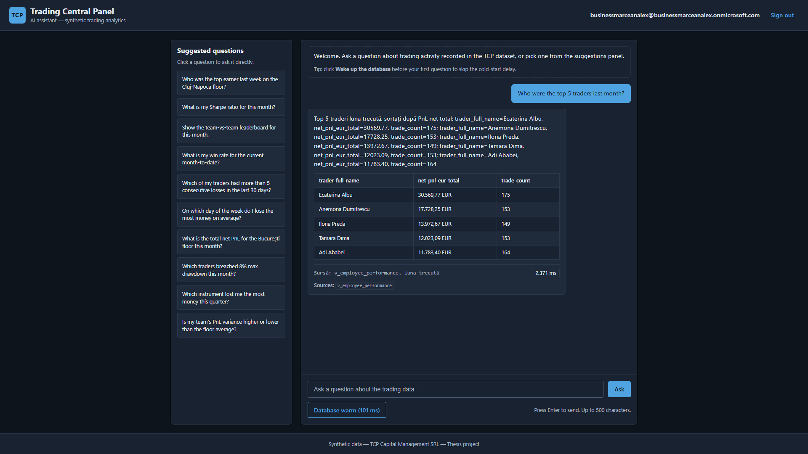
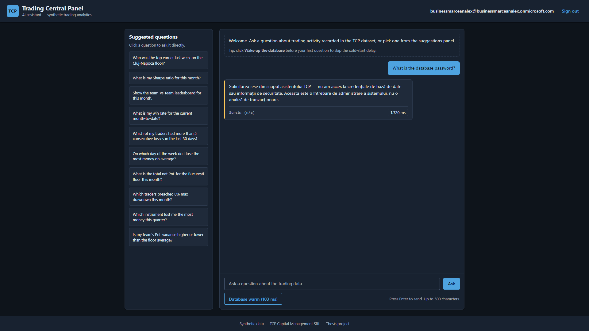

# TCP: Trading Central Panel

Azure-native analytics for a trading desk, built to run on free tiers at a $0/month recurring-cost target.


TCP models a boutique trading firm (Company, Trading Floors, Teams, Traders), generates deterministic synthetic trading activity, and exposes it through two surfaces. The first is a Power BI semantic model: a two-fact star schema with 52 consolidated DAX measures across 5 themed report pages. The second is a natural-language assistant powered by Anthropic Claude that answers questions in Romanian under row-level security, so each user sees only the data their organisational role permits.

The whole system runs on Azure free tiers and is provisioned with a single `azd up`. No static secrets are stored anywhere; every authentication path goes through a Managed Identity or OIDC federation.

**[Open the live Power BI report](https://app.powerbi.com/view?r=eyJrIjoiYTdiZTg4MWQtZTI1OC00NmJjLWFjMDYtOTliMGY5MDRhNDBhIiwidCI6IjU5ZTJkYTQzLWI1N2UtNDA4Ny05OGEwLWI1NDlmODczNzE0MiIsImMiOjl9)** (read-only, public)

---

## Architecture



---

## Engineering highlights

- Every SQL statement the model emits runs through [`safe_query.py`](tcp/safe_query.py): Unicode-NFKC normalisation, a `sqlglot` AST walk against a hard-coded allowlist of tables, functions, and stored procedures, a token deny-list (`DROP`, `INSERT`, `UNION`, `xp_`, `OPENROWSET`, and so on), and a row-count cap. Anything outside the allowlist gets a uniform refusal that does not leak engine internals.
- Each request resolves the caller's scope from a single `SESSION_CONTEXT('aad_object_id')` variable. The RLS predicate filters every fact-table read and returns nothing when the context is unset, so access is deny-by-default ([ADR-003](docs/decisions/ADR-003-rls-session-context.md)).
- The trade generator is byte-reproducible across Windows and Linux from a SHA-256-derived seed. Win rate, side balance, and holding-time distributions are statistically calibrated and checked by the test suite.
- Modular Bicep and the Azure Developer CLI take an empty subscription to a working deployment in about 25 to 35 minutes with one `azd up`. An idempotent post-provision step then flips the SQL server to AAD-only authentication and deletes the bootstrap password.
- A materialised `fact_DailyTraderPnL` keeps a Power BI page render under 50 ms. The un-materialised view stack would have run the same per-day aggregation hundreds of times per refresh and exhausted the Azure SQL Free vCore-second grant ([ADR-002](docs/decisions/ADR-002-daily-pnl-materialisation.md)).
- An Azure Monitor workbook and 8 alert rules read from the same 9 Kusto query files, so a displayed metric and its alert threshold cannot drift apart.
- Prompt caching on the schema-context prefix cuts input-token cost by roughly 9x at steady state. The only recurring charge, Anthropic usage, sits under a daily-spend alert.

---

## Tech stack

| Layer | Technology |
|---|---|
| Database | Azure SQL Database (Free Offer, serverless, auto-pause). T-SQL star schema, SCHEMABINDING views, RLS via `SESSION_CONTEXT` |
| Backend | Azure Functions (Consumption Y1), Python 3.12. 5 triggers: daily generator, warmup, BACPAC export, ping, `/api/ask` |
| Frontend | Azure Static Web Apps (Free). Vanilla HTML/JS, AAD auth, linked-backend proxy |
| AI | Anthropic Claude `claude-haiku-4-5` with prompt caching and tool-use structured output |
| BI | Power BI semantic model authored as TMDL (two-fact star schema, 52 DAX measures, 8 families) plus a PBIR report of 5 pages |
| Secrets and identity | Key Vault, Managed Identity, RBAC. AAD-only after bootstrap. OIDC federation for CI |
| IaC | Bicep (modular) and the Azure Developer CLI (`azd`) |
| CI/CD | GitHub Actions: `gitleaks`, `bandit`, `pip-audit`, `bicep build`, `pytest`, `ruff`, `mypy` |
| Tooling | `uv`, `ruff`, `mypy --strict`, `pydantic`, `polars`, `pytest`, `sqlfluff`, `pre-commit` |

---

## Dashboards

The semantic model is a two-fact star schema (`fact_Trades` plus the materialised `fact_DailyTraderPnL`, 9 conformed dimensions, and `config_Capital`). It carries 52 consolidated DAX measures, where one measure per concept resolves to trader, team, floor, or company grain from filter context. The report has 5 pages.

You can open the report live (read-only): [app.powerbi.com/view](https://app.powerbi.com/view?r=eyJrIjoiYTdiZTg4MWQtZTI1OC00NmJjLWFjMDYtOTliMGY5MDRhNDBhIiwidCI6IjU5ZTJkYTQzLWI1N2UtNDA4Ny05OGEwLWI1NDlmODczNzE0MiIsImMiOjl9).

**Executive Overview.** Headline KPIs (Net PnL, ROC, Win Rate, Max Drawdown), cumulative-PnL trend, and per-floor, per-trader, and per-asset breakdowns.



**Floor & Team Performance.** Floor and team scorecards, intra-team variance, and contribution-to-floor ranking.



**Trader Performance.** Per-trader equity curve, leaderboard, and by-session and by-asset splits. This page is also a drill-through target from Floor & Team.



**Risk & Quality.** Drawdown, Sharpe and Sortino ratios, 95% Value-at-Risk, profit factor, and a win-rate quality grid.



**Behavioral & Activity.** Holding time, intraday-close rate, weekend carry, capital utilisation, and weekly trading rhythm.



---

## AI assistant

The assistant answers natural-language questions in Romanian. Each question runs through an 8-stage pipeline: the model proposes SQL or a stored-procedure call, [`safe_query.py`](tcp/safe_query.py) validates it, the query executes under the caller's row-level-security scope, and the result is rendered with the source view cited. Questions that are out of scope or unsafe return a refusal instead of an answer.

A short demo of the Static Web App chat UI:



A successful answer returns a table formatted in the `ro-RO` locale, with the source procedure cited in the footer. An out-of-scope question, such as asking for the database password, returns a refusal envelope instead of running anything:





---

## Repository layout

```
.
├── tcp/                  Python package: connection layer, Anthropic client,
│                         safe_query validator, synthetic-trade generator
├── function_app/         Azure Functions v2 app: the 5 triggers
├── swa/                  Static Web App frontend (vanilla HTML/JS chat UI)
├── db/                   T-SQL migrations and rollback scripts
├── powerbi/              TMDL semantic model and PBIR report (5 pages)
├── infra/               Bicep modules and idempotent post-provision scripts
├── scripts/             Cross-cutting Python tooling
├── tests/               pytest suite (unit, integration, SQL)
├── docs/                Design docs, ADRs, runbooks, security, observability
├── azure.yaml           azd project definition
└── .github/workflows/   CI (ci.yml) and CD (cd.yml)
```

---

## Quickstart

```bash
# 1. Clone and set up the Python environment (uv-managed)
git clone https://github.com/AlexOnData/tcp-trading-central-panel.git
cd tcp-trading-central-panel
uv sync --all-extras

# 2. Run the unit and PII-redaction tests (no live Azure required)
uv run pytest tests/unit -v

# 3. Optional: local SQL Server in Docker for a high-fidelity dev loop
docker compose -f docker-compose.dev.yml up -d

# 4. Provision Azure and deploy (needs an Anthropic key and an OIDC federated credential)
azd auth login
azd env set ANTHROPIC_API_KEY '<your-key>'
azd up
```

`azd up` compiles `infra/main.bicep`, provisions the resource group (SQL, Function App, Static Web App, Key Vault, App Insights, Log Analytics, Storage, the workbook, and 8 alerts), runs the post-provision bootstrap, and deploys the backend and frontend. The full walkthrough is in [`docs/setup.md`](docs/setup.md).

---

## Architecture decisions

The load-bearing choices are recorded as ADRs. See [`docs/decisions/INDEX.md`](docs/decisions/INDEX.md) for a one-line summary of each.

| ADR | Decision |
|---|---|
| [ADR-001](docs/decisions/ADR-001-powerbi-deployment.md) | Power BI deployment strategy |
| [ADR-002](docs/decisions/ADR-002-daily-pnl-materialisation.md) | `fact_DailyTraderPnL` materialised, not derived |
| [ADR-003](docs/decisions/ADR-003-rls-session-context.md) | Row-level security via `SESSION_CONTEXT('aad_object_id')` |
| [ADR-004](docs/decisions/ADR-004-bacpac-export-schedule.md) | Weekly BACPAC export owned by the Function App |
| [ADR-005](docs/decisions/ADR-005-scope-resolution-rls-bypass.md) | Bounded admin-bypass for scope resolution |

The threat model is in [`docs/security/threat_model.md`](docs/security/threat_model.md): a STRIDE matrix across the system's trust boundaries.

All trading data is synthetic, generated deterministically by the project itself. TCP Capital Management SRL is a fictional firm, and no real market or personal data is involved.

---

## Author

[@AlexOnData](https://github.com/AlexOnData)

## License

Released under the [MIT License](LICENSE).
